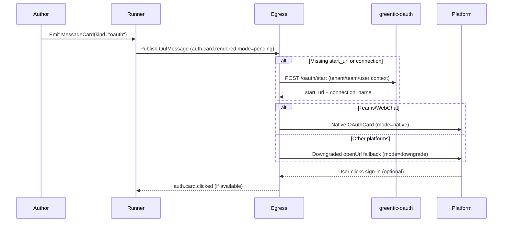

# greentic_messaging
Serverless-ready messaging runtime for multi-platform chat, with NATS routing and MessageCard translation.
This repo contains:
- apps/: ingress/egress/runner/subscriptions services
- libs/: shared crates (core types, translators, security)
- examples/: flows and payloads

## Build
```bash
cargo build
```
## Test
```bash
cargo test
cargo test -p gsm-runner --features chaos -- --ignored chaos
```

## Test Coverage

Automated coverage runs in CI through `cargo-tarpaulin`; every push and pull
request uploads an LCOV report as a build artifact. To reproduce the numbers
locally:

```bash
cargo install cargo-tarpaulin
cargo tarpaulin --workspace --all-features --out Lcov --output-dir coverage
```

The generated `coverage/` directory contains the LCOV output that mirrors the
artifact uploaded by GitHub Actions.

## Quickstart via greentic-messaging CLI

The workspace ships with a thin orchestration CLI. Start with:

```bash
cargo run -p greentic-messaging-cli -- info
cargo run -p greentic-messaging-cli -- dev up
cargo run -p greentic-messaging-cli -- serve ingress slack --tenant acme
cargo run -p greentic-messaging-cli -- flows run --flow examples/flows/weather_telegram.yaml --platform telegram --tenant acme
cargo run -p greentic-messaging-cli -- test fixtures
cargo run -p greentic-messaging-cli -- admin guard-rails show
```

The CLI inspects `GREENTIC_ENV`, detects tenants/teams from your local secrets
directory (defaults to `./secrets`), and wraps the existing Makefile targets so
you can bring up ingress/egress/subscription services without memorising every
command. Refer to [docs/cli.md](docs/cli.md) for the expanding command
reference.

## Design Docs

- [Telemetry, secrets, and session wiring](docs/DESIGN-telemetry-secrets.md)

## Releases & Publishing

- Versions are derived from each crate's `Cargo.toml`.
- Pushing to `master`: if any crate's version changed in the commit, `<crate>-v<version>` tags are created and pushed automatically.
- The publish workflow then attempts to publish the updated crates to crates.io using the `CARGO_REGISTRY_TOKEN` secret.
- Publishing is idempotent; runs succeed even when every version is already available on crates.io.

## Environment & Tenant Context

- `GREENTIC_ENV` selects the environment scope for a deployment (`dev`, `test`, `prod`). When unset, the runtime defaults to `dev` so local flows continue to work without extra configuration.
- Every ingress normalises requests into an `InvocationEnvelope` carrying a full `TenantCtx` (`env`, `tenant`, optional `team`/`user`, tracing metadata). Downstream services (runner, egress) now receive the same shape regardless of source platform.
- Export `TENANT` (and optionally `TEAM`) alongside channel-specific secrets when running locally so worker subjects resolve correctly.
- Secrets resolvers and egress senders consume the shared context, making it safe to host multiple environments or teams within a single process.
- Provider credentials live under `secret://{env}/{tenant}/{team|default}/messaging/{platform}-{team|default}-credentials.json`, so each environment stays isolated by design.

## Telemetry

Set the following environment variables to emit spans and OTLP traces when running locally:

- `OTEL_EXPORTER_OTLP_ENDPOINT=http://localhost:4317`
- `RUST_LOG=info`
- `OTEL_RESOURCE_ATTRIBUTES=deployment.environment=dev`

### Dev-Friendly Logging

During iterative development you can toggle structured stdout logs without
pushing traces to an OTLP collector by exporting `GREENTIC_DEV_TELEMETRY=1`.
The flag automatically sets `GT_TELEMETRY_FMT=1`, which tells the shared
`greentic-telemetry` crate to install a JSON `tracing_subscriber::fmt` layer on
top of the OTLP pipeline. Point `RUST_LOG=debug` if you need verbose spans in
addition to the structured output. (The previous `./<service>.log` files created
by the bespoke telemetry shim are no longer emitted.)

### MessageCard Telemetry & Limits

- Every renderer emits a `TelemetryEvent::Rendered` record with `render_tier`, `warning_count`, `limit_exceeded`, `sanitized_count`, `url_blocked_count`, modal usage, plus one-hot `native_count`/`downgrade_count` flags so you can differentiate fully supported payloads from downgraded ones. Attach a custom `TelemetryHook` through `MessageCardEngine::with_telemetry` to capture those metrics.
- Basic and Advanced tiers automatically run the Markdown sanitizer; HTML tags and unsafe Unicode line breaks are stripped before rendering. The `sanitized_count` field increments for every field that required cleanup.
- Action URLs can be restricted by exporting `CARD_URL_ALLOW_LIST=https://example.com/,https://docs.example.com/`. Links outside the prefixes are removed from the payload, logged as warnings, and surfaced through `url_blocked_count`.
- Platform payload caps (25KB Adaptive cards, 3KB Slack/Webex text, 4KB Telegram/WhatsApp messages, and per-platform button limits) are enforced automatically. When truncation happens, the rendered payload stays valid, a warning is added, and `limit_exceeded=true` is reported through telemetry.

### Golden Fixtures & Previewing

- Source fixtures for Adaptive Cards live under `libs/core/tests/fixtures/cards/`; the renderer-specific snapshots sit in `libs/core/tests/fixtures/renderers/`. Each new card variant (columns, show cards, premium execute actions, etc.) should have an entry in both folders.
- Run the snapshot suites locally to regenerate or verify expected payloads: `cargo test -p gsm-core --features "adaptive-cards directline_standalone" --test renderers_snapshot`.
- The lightweight Playwright renderer under `tools/renderers/` can turn any fixture into a PNG. Example:
  ```bash
  cd tools/renderers
  npm ci
  node render.js --in ../../libs/core/tests/fixtures/cards/inputs_showcard.json --out output/inputs_showcard.png
  ```
  This is handy for designers reviewing the golden set before we wire it into the dev-viewer in PR-12.
- Need a live preview? Launch the new dev-viewer and open the browser UI:
  ```bash
  cargo run -p dev-viewer -- --listen 127.0.0.1:7878 --fixtures libs/core/tests/fixtures/cards
  # Visit http://127.0.0.1:7878 and use “Preview All Platforms” to inspect Slack/Teams/Webex/etc.
  ```
  Paste a `MessageCard` JSON payload or load one of the shipped fixtures—the viewer normalizes it through `gsm-core`, downgrades per platform, and shows warnings, tier downgrades, and renderer payloads side-by-side.
  For automation, hit `GET /healthz` once the process starts to know when the viewer is ready.

### Messaging-test CLI

- `cargo run -p greentic-messaging-test -- fixtures` lists discovered MessageCard fixtures.
- `cargo run -p greentic-messaging-test -- adapters` prints every adapter along with whether it is enabled and a reason for why it might be disabled.
- `cargo run -p greentic-messaging-test -- run <fixture> --dry-run` launches an interactive keyboard session. Press **Enter** or `r` to re-send, `n/p` to cycle fixtures, `a` to toggle adapters (enter a comma-separated list or `all`), and `q` to quit. Artifacts are written to `./.gsm-test/artifacts/<fixture>/<adapter>`, where `translated.json` is redacted before being recorded.
- `cargo run -p greentic-messaging-test -- all --dry-run` iterates every fixture in a non-interactive way and generates the same artifacts tree. Run `cargo run -p greentic-messaging-test -- gen-golden` afterward to copy the translated payloads into `crates/messaging-test/tests/golden/<fixture>/<adapter>/translated.json`.

## Gateway + Egress flow

The new default deployment is a pair of binaries that consolidate every ingress adapter behind a single HTTP facade and dispatch all outbound traffic through one JetStream consumer.

1. `gsm-gateway` accepts HTTP `POST` requests on `/api/{tenant}/{channel}` or `/api/{tenant}/{team}/{channel}`. Provide a small JSON body with `chatId`, `userId`, `text`, optional `threadId`, and an optional `metadata` map. The gateway injects `TenantCtx` (reading `GREENTIC_ENV`, the tenant/team from the path, and `x-greentic-user` if present), normalizes the payload into a `MessageEnvelope`, and publishes it to `greentic.messaging.ingress.{env}.{tenant}.{team}.{channel}`.
2. `messaging-egress` subscribes to `greentic.messaging.egress.{env}.>` (configurable via `MESSAGING_EGRESS_SUBJECT`) and routes each `OutMessage` through the translator/sender stack. The runtime reuses `DefaultResolver`, `TenantCtx`, and the existing provider senders so the gateways can be wired up to real Slack/Teams/Webex/Telegram/WebChat credentials without per-provider binaries.

Run locally with:
```bash
GREENTIC_ENV=dev NATS_URL=nats://127.0.0.1:4222 cargo run -p gsm-gateway
TENANT=acme NATS_URL=nats://127.0.0.1:4222 cargo run -p messaging-egress
```
Point your test client at `http://localhost:8080/api/acme/default/webchat` with a JSON payload such as `{"chatId":"chat-1","userId":"user-42","text":"hi","metadata":{"channelData":{"env":"dev","tenant":"acme"}}}` and watch the gateway publish to NATS. The egress log will print the normalized `OutMessage` that would be sent to the downstream provider. This flow makes it easy to reason about the runtime without maintaining one binary per platform.

## Tenant bootstrap CLI

`messaging-tenants` is the helper CLI that writes tenant/platform credentials into `greentic-secrets` so humans don’t have to hand-craft URIs.

1. Prepare your env/tenant/team:
   ```bash
   cargo run -p messaging-tenants -- init-env --env dev
   cargo run -p messaging-tenants -- add-tenant --env dev --tenant acme --team support
   ```
2. Write credentials JSON for each platform:
   ```bash
   cargo run -p messaging-tenants -- set-credentials \
     --env dev --tenant acme --team support \
     --platform slack --file ./slack-creds.json
   ```
   Each invocation stores a secret at `secret://{env}/{tenant}/{team}/messaging/{platform}-{team}-credentials.json`, so the runtime can lift the correct credential bundle from `DefaultResolver` without extra wiring.

3. Point `messaging-egress` at the same `GREENTIC_ENV`/`TENANT` and the credentials walk through to the downstream providers automatically.

Real sends require all adapter credentials to be exported (dry-run is the default). The required environment variables are:

| Adapter | Env vars |
| --- | --- |
| `teams` | `MS_GRAPH_TOKEN` |
| `webex` | `WEBEX_BOT_TOKEN` |
| `slack` | `SLACK_BOT_TOKEN` |
| `webchat` | `WEBCHAT_SECRET` (optionally `WEBCHAT_ENDPOINT`) |
| `telegram` | `TELEGRAM_BOT_TOKEN` |
| `whatsapp` | `WHATSAPP_TOKEN` |

The tool never references an email adapter, and the WebChat adapter is always named `webchat` (never “DirectLine”). Use the artifacts alongside the built-in smoke test (`cargo test -p greentic-messaging-test`) or the CI job to keep the translated payloads aligned with the goldens.

## Sending Messages

All egress adapters now share a common interface: pass a `TenantCtx` alongside an
`OutboundMessage` and the sender selects the scoped credentials automatically.

```rust
use std::sync::Arc;

use gsm_core::egress::{OutboundMessage, SendResult};
use gsm_core::platforms::slack::sender::SlackSender;
use gsm_core::prelude::{make_tenant_ctx, DefaultResolver};

#[tokio::main]
async fn main() -> anyhow::Result<()> {
    // GREENTIC_ENV defaults to "dev" but can be overridden for other scopes.
    unsafe { std::env::set_var("GREENTIC_ENV", "dev"); }

    let ctx = make_tenant_ctx("acme".into(), Some("support".into()), None);
    let resolver = Arc::new(DefaultResolver::new().await?);
    let sender = SlackSender::new(reqwest::Client::new(), resolver, None);

    let msg = OutboundMessage {
        channel: Some("C123".into()),
        text: Some("Hello from Greentic".into()),
        payload: None,
    };

    let SendResult { message_id, .. } = sender.send(&ctx, msg).await?;
    println!("posted message id: {:?}", message_id);
    Ok(())
}
```

For testing, each egress binary exposes a `mock-http` Cargo feature that swaps
remote API calls for in-memory mocks (`cargo test -p gsm-egress-slack --features
mock-http`).

## Slack Integration

1. Create a Slack app with a Bot User token (Scopes: `app_mentions:read`, `channels:history`, `groups:history`, `im:history`, `mpim:history`, `chat:write`, `commands`).
2. Run the OAuth helper to install the app per tenant/team:
   ```bash
   export SLACK_CLIENT_ID=...
   export SLACK_CLIENT_SECRET=...
   export SLACK_REDIRECT_URI=https://<public-host>/slack/callback
   export SLACK_SCOPES="app_mentions:read,channels:history,chat:write"
   export SLACK_SIGNING_SECRET=...
   cargo run -p gsm-slack-oauth
   ```
   Visit `/slack/install?tenant=acme&team=support` to initiate an install. When Slack redirects back to `/slack/callback`, the handler stores the workspace credentials at `/{env}/messaging/slack/{tenant}/{team}/workspace/<team_id>.json` (the runtime defaults to `env=dev`).
3. Start the services:
   ```bash
   make stack-up             # optional: start local nats/docker stack
   make run-ingress-slack
   make run-egress-slack
   FLOW=examples/flows/weather_slack.yaml PLATFORM=slack make run-runner
   ```
4. Point Slack Event Subscriptions to `/ingress/slack/{tenant}/{team}/events`. The ingress verifies the signing secret, emits an `InvocationEnvelope`, and publishes to NATS. Replies with a `thread_ts` keep the conversation threaded.

## Microsoft Teams Integration

1. Register an Azure AD app with permissions to Microsoft Graph (`Chat.ReadWrite`, `ChannelMessage.Send`, `ChatMessage.Send`) and create a client secret. Configure a subscription webhook pointing to `/teams/webhook`.
2. Export required values:
   ```bash
   export MS_GRAPH_TENANT_ID=...
   export MS_GRAPH_CLIENT_ID=...
   export MS_GRAPH_CLIENT_SECRET=...
   export TEAMS_WEBHOOK_URL=https://<public>/teams/webhook
   export TENANT=acme
   export NATS_URL=nats://127.0.0.1:4222
   ```
3. Start the services (ingress, egress, subscription manager):
   ```bash
   make run-ingress-teams
   make run-egress-teams
   make run-subscriptions-teams
   FLOW=examples/flows/weather_telegram.yaml PLATFORM=teams make run-runner
   ```
4. Add the Graph subscription through the admin subject (`greentic.subs.admin`) or use the runner to trigger messages; cards are translated into Adaptive Cards for Teams.

### Teams Test Credentials

1. Register (or reuse) an Azure AD application with the Microsoft Graph `ChatMessage.Send` **application** permission and create a client secret dedicated to CI/testing.
2. Collect the following values: `TEAMS_TENANT_ID`, `TEAMS_CLIENT_ID`, `TEAMS_CLIENT_SECRET`, and the target `TEAMS_CHAT_ID`.
3. Verify the chat and persist the secrets with the helper:
   `cargo run --manifest-path scripts/Cargo.toml --bin teams_setup -- --tenant <tenant> --client-id <client_id> --client-secret <client_secret> --chat-id <chat_id> --output .env`
4. Run the Teams E2E test when needed:
   `cargo test -p gsm-egress-teams --features e2e -- --ignored --nocapture`

## Admin & Security Helpers

Optional guard rails apply to all ingress services (Telegram, Slack, etc.) through `apps/ingress-common/src/security.rs`. Leave them unset for local dev, or export them and supply matching headers when you need protection.

- `INGRESS_BEARER`: when set, requests must include `Authorization: Bearer $INGRESS_BEARER`.
- `INGRESS_HMAC_SECRET`: enable HMAC validation for webhook/admin calls; compute base64(hmac_sha256(secret, body)) and send it in `INGRESS_HMAC_HEADER` (defaults to `x-signature`).
- `INGRESS_HMAC_HEADER`: override the signature header name.

Action Links (optional): provide `JWT_SECRET`, `JWT_ALG` (e.g. HS256), and `ACTION_BASE_URL` so ingress can generate signed deeplinks for card actions. Missing JWT envs just disable the feature (you’ll see a log warning).

Admin endpoints share the same middleware stack as `/telegram/webhook`. If guards are enabled, include the headers when curling (example below). Otherwise, the endpoints are open on localhost.

Example status call with bearer + HMAC:
```bash
sig=$(printf '' | openssl dgst -binary -sha256 -hmac "$INGRESS_HMAC_SECRET" | base64)
curl -s \
  -H "Authorization: Bearer $INGRESS_BEARER" \
  -H "${INGRESS_HMAC_HEADER:-x-signature}: $sig" \
  http://localhost:8080/admin/telegram/acme/status | jq
```

## MessageCard Schema

- The canonical schema for MessageCard payloads lives at `libs/core/schema/message_card.schema.json` (version 1.2.0). It now models the `kind` discriminator plus the optional OAuth descriptor (`oauth` block).
- See `docs/changelog.md` for schema history and notable contract updates.
- Downstream tooling (dev-viewer, fixture generators, etc.) can load the schema directly to validate authoring experiences and to surface errors earlier in CI.
- The schema continues to accept plain text/image cards and Adaptive payloads while marking OAuth cards as premium so the renderer can tier them correctly.

## OAuth Cards

- Set `kind: "oauth"` on Adaptive MessageCards when you need Teams or Bot Framework sign-in cards. The `oauth` block carries the provider (`microsoft`, `google`, `github`, or `custom`), scopes, optional resource/audience, and metadata your flows may need later.
- Point every egress adapter (and the dev-viewer) at your greentic-oauth deployment by exporting `OAUTH_BASE_URL=https://oauth.greentic.dev/`. When the card omits `start_url`, egress calls `POST $OAUTH_BASE_URL/oauth/start` with the tenant/team/user context and backfills the signed URL automatically. The same response also includes the Bot Framework `connectionName`; Teams/WebChat need it for native OAuth cards, and the presets live inside greentic-oauth so you don’t have to hard-code anything.
- The runner emits `auth.card.rendered` telemetry as soon as a card makes it onto the out subject (`mode=pending`). Every egress adapter follows up with another `auth.card.rendered` tagged `mode=native` or `mode=downgrade` plus the resolved `connection_name`, provider, and start-url domain. Bot Framework clicks bubble back through `auth.card.clicked` events so the pipeline can correlate completions.

### Downgrade Matrix

| Platform | Mode | Notes |
| --- | --- | --- |
| Teams | **Native** | Renders `application/vnd.microsoft.card.oauth` with preset `connectionName`. Missing presets cause an automatic downgrade with a warning. |
| WebChat / Bot Framework Direct Line | **Native** | Same OAuthCard schema as Teams. Connection names come from greentic-oauth presets or explicit `oauth.connection_name`. |
| Slack | Downgraded | The renderer produces a basic blocks card with a single `openUrl` button pointing at the OAuth start URL plus a short disclaimer. |
| Telegram | Downgraded | Sends a chat message plus one inline button opening the start URL. |
| Webex | Downgraded | Emits a slim Adaptive Card with a single `Action.OpenUrl`. |
| WhatsApp | Downgraded | Uses the template transport with a single URL button; the title mirrors the provider (“Sign in with {Provider}”). |

### How It Works

```
Author -> Runner -> NATS -> Egress Adapter -> greentic-oauth -> Platform
             |               |                    |
             |               |-- auth.card.rendered (mode=native|downgrade)
             |-- auth.card.rendered (mode=pending)

1. Runner publishes an `OutMessage` carrying the Adaptive OAuth card.
2. The egress worker acquires a permit, calls `/oauth/start` when `start_url` is missing, and resolves `connection_name` presets when the card left it empty.
3. Teams/WebChat receive a native OAuthCard; everyone else gets an “open URL” fallback built by `MessageCardEngine::oauth_fallback_ir`.
4. Click telemetry (when available) fans back through the same tenant/team labels so you can correlate completions.
```



### Troubleshooting

- **`OAUTH_BASE_URL` unset:** egress logs a warning, emits `mode=downgrade`, and the user receives the open URL fallback. Set the variable on every adapter and on the dev-viewer when you need end-to-end OAuth testing.
- **Preset missing for Teams/WebChat:** the greentic-oauth service returns a start URL but no `connection_name`. Egress will downgrade, log `missing connection name`, and your metrics will show `mode=downgrade` plus `downgrade_count=1`.
- **Start builder errors:** transient HTTP failures keep the message in-flight (we `Nak` the JetStream delivery). Hard failures (4xx) produce a downgraded fallback so the conversation keeps moving.
- **Payload issues:** snapshot the platform payloads with `cargo test -p gsm-core --features "adaptive-cards directline_standalone" --test renderers_oauth -- --nocapture` and compare against `libs/core/tests/fixtures/renderers/**/oauth_*`. The dev-viewer is also aware of OAuth intents and will show you when the renderer fell back.


## Premium Deeplinks & JWT State

- `MessageCardIr.meta.app_link` can now carry a structured `state` payload plus an optional `jwt` section. When present, renderers append a `state_jwt=<token>` query param alongside the `target` URL.
- `state` must be a JSON object/array and stays under 2KB; other shapes are dropped with a renderer warning so downstream services stay consistent.
- JWT claims include `target`, `tenant`, `scope`, and the provided `state` blob. Tokens are signed with HS256/384/512 (default HS256) and expire after `ttl_seconds` (default 900).
- Example IR snippet:
  ```rust
  use serde_json::json;
  use gsm_core::messaging_card::ir::{AppLink, AppLinkJwt};

  ir.meta.app_link = Some(AppLink {
      base_url: "https://premium.example/deeplink".into(),
      secret: None,
      tenant: Some("acme".into()),
      scope: Some("beta".into()),
      state: Some(json!({"flow": "demo", "step": 2 })),
      jwt: Some(AppLinkJwt {
          secret: std::env::var("APP_LINK_JWT_SECRET")?,
          algorithm: "HS256".into(),
          audience: Some("preview".into()),
          issuer: Some("greentic".into()),
          ttl_seconds: 600,
      }),
  });
  ```
- Rotate secrets per tenant/app and keep the TTL short so deeplinks remain ephemeral; receivers should verify the JWT before honoring the action.


## Telegram Integration

1. Create a Telegram bot via BotFather and obtain the bot token; configure the webhook secret if desired.
2. Export environment variables:
   ```bash
   export TELEGRAM_SECRET_TOKEN=dev
   export TENANT=acme
   # Optional: point to a tenants.yaml file if you manage multiple tenants
   # export TENANT_CONFIG=config/tenants.yaml
   # TELEGRAM_PUBLIC_WEBHOOK_BASE will fall back to http://localhost:8080/telegram/webhook
   export TELEGRAM_PUBLIC_WEBHOOK_BASE=https://gsm.greentic.ai/telegram/webhook
   export NATS_URL=nats://127.0.0.1:4222
   ```
3. Start ingress, egress, and the runner:
```bash
make run-ingress-telegram
make run-egress-telegram
FLOW=examples/flows/weather_telegram.yaml PLATFORM=telegram make run-runner
```
4. Set the Telegram webhook to point at `/telegram/webhook`. Messages sent to the bot are normalized, routed through NATS, and responses are delivered via the Telegram egress adapter using the official Bot API.

**Tenant configuration**

- `TENANT` identifies the default tenant for single-tenant deployments and is used when subscribing to inbound subjects.
- `TENANT_CONFIG` (optional) points at a YAML file describing tenants and their Telegram settings. When omitted, the service synthesizes a single-tenant configuration from the environment variables above.

**Secrets & tenants**

- Secrets default to environment variables named `TENANTS_<TENANT>_TELEGRAM_BOT_TOKEN` and `TENANTS_<TENANT>_TELEGRAM_SECRET_TOKEN` (uppercase, slashes replaced with `_`). Provide these or configure `TENANT_CONFIG` to source them elsewhere.

**Startup reconciliation & admin endpoints**

- On boot the ingress service reconciles Telegram webhooks for every enabled tenant and emits `greentic_telegram_webhook_reconciles_total{tenant,result}` metrics.
- The admin API exposes helpers for CI/ops:
  - `POST /admin/telegram/{tenant}/register`
  - `POST /admin/telegram/{tenant}/deregister`
  - `GET  /admin/telegram/{tenant}/status`
- Bootstrap secrets before enabling a tenant: store `tenants/<tenant>/telegram/bot_token` and `tenants/<tenant>/telegram/secret_token` (or allow the service to generate the secret if your store supports writes).
- First-time registration sets `drop_pending_updates=true`; the admin `register` endpoint keeps history by default (`drop_pending_updates=false`).

## WebChat Integration

1. Embed the widget script on any page and provide tenant context via data attributes:
   ```html
   <script src="https://<your-ingress>/widget.js" data-tenant="acme" data-team="support" data-env="dev"></script>
   ```
   The widget automatically includes these values in `channelData` when posting to the ingress.
2. Export the runtime variables (egress still uses `TENANT` to select the outbound subject):
   ```bash
   export NATS_URL=nats://127.0.0.1:4222
   export TENANT=acme
   ```
3. Launch the services:
   ```bash
   make run-ingress-webchat
   make run-egress-webchat
   FLOW=examples/flows/weather_slack.yaml PLATFORM=webchat make run-runner
   ```
4. POST inbound messages to `/webhook` with camelCase keys:
   ```json
   {
     "chatId": "chat-1",
     "userId": "user-42",
     "text": "Hello",
     "channelData": {
       "tenant": "acme",
       "team": "support",
       "env": "dev"
     }
   }
   ```
  Tenant is required; team is optional. Open `http://localhost:8090` to try the sample form that ships with the ingress.

## WhatsApp Integration

1. Create a WhatsApp Business App, obtain the phone number ID, and generate a permanent user access token. Pick a webhook verify token and note the app secret.
2. Store the credentials in your secrets backend (example uses `greentic-secrets` and the `dev` environment):
   ```bash
   cat <<'JSON' | greentic-secrets put secret://dev/messaging/whatsapp/acme/credentials.json
   {
     "phone_id": "1234567890",
     "wa_user_token": "EAA...",
     "app_secret": "meta-app-secret",
     "verify_token": "verify-token"
   }
   JSON
   ```
3. Export the runtime configuration for local egress (credentials are read from the secret; templates are optional overrides):
   ```bash
   export WA_TEMPLATE_NAME=weather_update
   export WA_TEMPLATE_LANG=en
   export TENANT=acme
   export NATS_URL=nats://127.0.0.1:4222
   ```
4. Run ingress and egress (pass `--features mock-http` to the binaries if you want to stub outbound calls during testing):
   ```bash
   make run-ingress-whatsapp
   make run-egress-whatsapp
   ```
5. Configure Meta to call `/ingress/whatsapp/{tenant}` with your verify token. Inbound messages publish to NATS and are delivered via egress; card responses automatically fall back to templates or deep links when the 24-hour session window has expired.

### WhatsApp Cloud API Test Credentials

1. Generate a permanent user access token in the [Meta Developer Dashboard](https://developers.facebook.com/apps/) with the `whatsapp_business_messaging` permission and copy your phone number ID.
2. Verify the credentials with the helper script (optionally writing them to `.env`):
   `cargo run --manifest-path scripts/Cargo.toml --bin whatsapp_setup -- --token <token> --phone-id <phone_id> --recipient <E.164 number> --output .env`
3. Your `.env` should now include `WHATSAPP_TOKEN`, `WHATSAPP_PHONE_ID`, and `WHATSAPP_RECIPIENT`, which the WhatsApp E2E test consumes.

## Webex Integration

1. Create a [Webex bot](https://developer.webex.com/my-apps/new/bot) and note the Bot Access Token. Configure a webhook pointing to `/webex/messages` with a secret.
2. Export runtime configuration:
   ```bash
   export WEBEX_WEBHOOK_SECRET=super-secret
   export WEBEX_BOT_TOKEN=BearerTokenFromStep1
   export TENANT=acme
   export NATS_URL=nats://127.0.0.1:4222
   ```
3. Start the ingress and egress services:
   ```bash
   make run-ingress-webex
   make run-egress-webex
   FLOW=examples/flows/weather_webex.yaml PLATFORM=webex make run-runner
   ```
4. Set the webhook target URL (`https://<public>/webex/messages`). Messages sent to the bot are normalised, deduplicated, and republished through NATS; the egress worker handles rate limits, retries, and Adaptive Card rendering for Webex spaces.

### Webex Test Credentials

1. Visit <https://developer.webex.com/my-apps> and create a **Bot**. Copy the **Bot Access Token** when it is shown and store it as `WEBEX_BOT_TOKEN`.
2. Create (or pick) a Webex space for testing, then add the bot to the space so it can post messages.
3. List rooms accessible to the bot to find the room ID:
   `curl --request GET "https://webexapis.com/v1/rooms?type=group" --header "Authorization: Bearer $WEBEX_BOT_TOKEN" --header "Content-Type: application/json"`
   Use the `id` that matches your space and set it as `WEBEX_ROOM_ID`.
4. Optionally verify the bot can post with:
   `curl --request POST "https://webexapis.com/v1/messages" --header "Authorization: Bearer $WEBEX_BOT_TOKEN" --header "Content-Type: application/json" --data '{"roomId":"<WEBEX_ROOM_ID>","text":"Webex bot connected"}'`

## Visual Regression Tooling

Optional tooling under `tools/` supports screenshot and Adaptive Card regression tests.

1. Install dependencies (this generates `package-lock.json` for each tool):
   ```bash
   (cd tools/playwright && npm install)
   (cd tools/renderers && npm install)
   ```
2. Capture a screenshot via Playwright (credentials can also come from environment variables):
   ```bash
   TEST_LOGIN_EMAIL=you@example.com TEST_LOGIN_PASSWORD=secret \
     node tools/playwright/index.mjs --permalink https://app.local/chat/123 \
     --out tools/playwright/output/example.png
   ```
3. Render Adaptive Card JSON locally:
   ```bash
   node tools/renderers/render.js \
     --in libs/cards/samples/weather.json \
     --out tools/renderers/output/weather.png
   ```

After the lockfiles exist, use `npm ci` within each directory for clean, reproducible installs.
