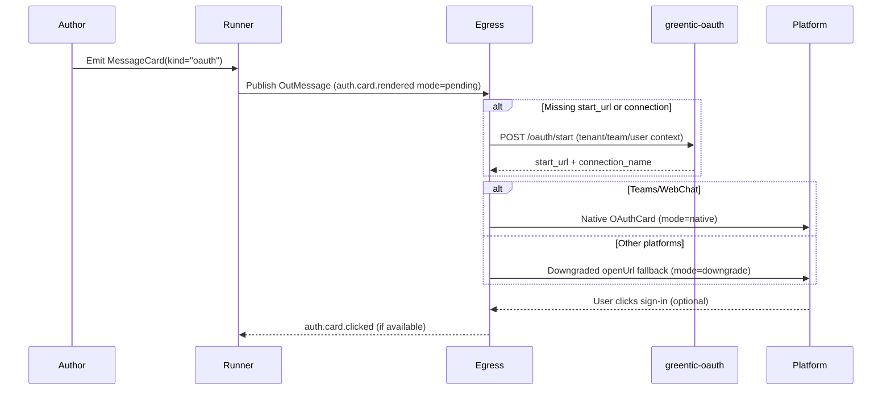

# greentic_messaging
Serverless-ready messaging runtime for multi-platform chat, with NATS routing and MessageCard translation.
This repo contains:
- apps/: ingress/egress/runner/subscriptions services
- libs/: shared crates (core types, translators, security)
- examples/: flows and payloads

## Build
```bash
cargo build
```
## Test
```bash
cargo test
cargo test -p gsm-runner --features chaos -- --ignored chaos
```

## Test Coverage

Automated coverage runs in CI through `cargo-tarpaulin`; every push and pull
request uploads an LCOV report as a build artifact. To reproduce the numbers
locally:

```bash
cargo install cargo-tarpaulin
cargo tarpaulin --workspace --all-features --out Lcov --output-dir coverage
```

The generated `coverage/` directory contains the LCOV output that mirrors the
artifact uploaded by GitHub Actions.

## Quickstart (packs + greentic-messaging CLI)

The CLI is the supported entry point for dev and local serving. Provider packs
(`messaging-*.gtpack`) come from the providers repo and are required for setup.

```bash
# inspect env + pack resolution
greentic-messaging info

# start gateway/runner/egress (and tunnel by default)
greentic-messaging dev up

# run provider setup and persist install record
# use the provider id from the pack (see `greentic-messaging info`)
greentic-messaging dev setup messaging.telegram.bot

# tail local service logs
greentic-messaging dev logs --follow
```

To run a single service directly:

```bash
greentic-messaging serve ingress slack --tenant acme --team default
greentic-messaging serve egress --tenant acme --team default
greentic-messaging serve runner --tenant acme --team default
greentic-messaging serve subscriptions --tenant acme --team default
```

Pack overrides are supported on all commands:

```bash
greentic-messaging serve ingress webchat \
  --tenant acme \
  --pack /abs/path/to/messaging-webchat.gtpack \
  --no-default-packs
```

Refer to [docs/README.md](docs/README.md) for the full CLI reference and pack notes.

## Core vs Legacy

- Running `cargo test --workspace` now exercises the core runtime (the `greentic-messaging` CLI, its shared libs, and `greentic-messaging-pack-validator`). Legacy helpers (apps, translators, dev viewers, the old harness, etc.) are excluded from the default workspace to keep day-to-day builds fast.
- If you still need the legacy pieces, run `LOCAL_CHECK_LEGACY=1 ci/local_check.sh` or `./ci/legacy_check.sh`. Set `LEGACY_RUN_MESSAGING_TEST=1` to include the `greentic-messaging-test` harness in that run.
- The operator runtime contract is documented in `docs/MESSAGING_RUNTIME_CONTRACT.md`, which lists the flags and environment variables that `greentic-operator` still relies on from `greentic-messaging serve`.

## Design Docs

- [Messaging stack overview](docs/README.md)

## Releases & Publishing

- Versions are derived from each crate's `Cargo.toml`.
- Pushing to `master`: if any crate's version changed in the commit, `<crate>-v<version>` tags are created and pushed automatically.
- The publish workflow then attempts to publish the updated crates to crates.io using the `CARGO_REGISTRY_TOKEN` secret.
- Publishing is idempotent; runs succeed even when every version is already available on crates.io.

## Environment & Tenant Context

- `GREENTIC_ENV` selects the environment scope for a deployment (`dev`, `test`, `prod`). When unset, the runtime defaults to `dev` so local flows continue to work without extra configuration.
- Every ingress normalises requests into an `InvocationEnvelope` carrying a full `TenantCtx` (`env`, `tenant`, optional `team`/`user`, tracing metadata). Downstream services (runner, egress) now receive the same shape regardless of source platform.
- Set `TENANT` (and optionally `TEAM`) to route messages locally, but secret material must come from `greentic-secrets` (ctx + seed/apply), not ad hoc env vars.
- Secrets resolvers and egress senders consume the shared context, making it safe to host multiple environments or teams within a single process.
- Provider credentials are seeded via `greentic-secrets` using pack-declared secret requirements (see `fixtures/packs/messaging_secrets_smoke` for an example).

## Telemetry

Set the following environment variables to emit spans and OTLP traces when running locally:

- `OTEL_EXPORTER_OTLP_ENDPOINT=http://localhost:4317`
- `RUST_LOG=info`
- `OTEL_RESOURCE_ATTRIBUTES=deployment.environment=dev`

### Dev-Friendly Logging

During iterative development you can toggle structured stdout logs without
pushing traces to an OTLP collector by exporting `GREENTIC_DEV_TELEMETRY=1`.
The flag automatically sets `GT_TELEMETRY_FMT=1`, which tells the shared
`greentic-telemetry` crate to install a JSON `tracing_subscriber::fmt` layer on
top of the OTLP pipeline. Point `RUST_LOG=debug` if you need verbose spans in
addition to the structured output. (The previous `./<service>.log` files created
by the bespoke telemetry shim are no longer emitted.)

### MessageCard Telemetry & Limits

- Every renderer emits a `TelemetryEvent::Rendered` record with `render_tier`, `warning_count`, `limit_exceeded`, `sanitized_count`, `url_blocked_count`, modal usage, plus one-hot `native_count`/`downgrade_count` flags so you can differentiate fully supported payloads from downgraded ones. Attach a custom `TelemetryHook` through `MessageCardEngine::with_telemetry` to capture those metrics.
- Basic and Advanced tiers automatically run the Markdown sanitizer; HTML tags and unsafe Unicode line breaks are stripped before rendering. The `sanitized_count` field increments for every field that required cleanup.
- Action URLs can be restricted by exporting `CARD_URL_ALLOW_LIST=https://example.com/,https://docs.example.com/`. Links outside the prefixes are removed from the payload, logged as warnings, and surfaced through `url_blocked_count`.
- Platform payload caps (25KB Adaptive cards, 3KB Slack/Webex text, 4KB Telegram/WhatsApp messages, and per-platform button limits) are enforced automatically. When truncation happens, the rendered payload stays valid, a warning is added, and `limit_exceeded=true` is reported through telemetry.

### Golden Fixtures & Previewing

- Source fixtures for Adaptive Cards live under `libs/core/tests/fixtures/cards/`; the renderer-specific snapshots sit in `libs/core/tests/fixtures/renderers/`. Each new card variant (columns, show cards, premium execute actions, etc.) should have an entry in both folders.
- Run the snapshot suites locally to regenerate or verify expected payloads: `cargo test -p gsm-core --features "adaptive-cards directline_standalone" --test renderers_snapshot`.
- The lightweight Playwright renderer under `tools/renderers/` can turn any fixture into a PNG. Example:
  ```bash
  cd tools/renderers
  npm ci
  node render.js --in ../../libs/core/tests/fixtures/cards/inputs_showcard.json --out output/inputs_showcard.png
  ```
  This is handy for designers reviewing the golden set before we wire it into the dev-viewer in PR-12.
- Need a live preview? Launch the new dev-viewer and open the browser UI:
  ```bash
  cargo run -p dev-viewer -- --listen 127.0.0.1:7878 --fixtures libs/core/tests/fixtures/cards
  # Visit http://127.0.0.1:7878 and use “Preview All Platforms” to inspect Slack/Teams/Webex/etc.
  ```
  Paste a `MessageCard` JSON payload or load one of the shipped fixtures—the viewer normalizes it through `gsm-core`, downgrades per platform, and shows warnings, tier downgrades, and renderer payloads side-by-side.
  For automation, hit `GET /healthz` once the process starts to know when the viewer is ready.

### Messaging-test CLI

- `cargo run -p greentic-messaging-test -- fixtures` lists discovered MessageCard fixtures.
- `cargo run -p greentic-messaging-test -- adapters` prints every adapter along with whether it is enabled and a reason for why it might be disabled.
- `cargo run -p greentic-messaging-test -- run <fixture> --dry-run` launches an interactive keyboard session. Press **Enter** or `r` to re-send, `n/p` to cycle fixtures, `a` to toggle adapters (enter a comma-separated list or `all`), and `q` to quit. Artifacts are written to `./.gsm-test/artifacts/<fixture>/<adapter>`, where `translated.json` is redacted before being recorded.
- `cargo run -p greentic-messaging-test -- all --dry-run` iterates every fixture in a non-interactive way and generates the same artifacts tree. Run `cargo run -p greentic-messaging-test -- gen-golden` afterward to copy the translated payloads into `crates/messaging-test/tests/golden/<fixture>/<adapter>/translated.json`.
- Provider packs are now supported alongside card fixtures:
  - `cargo run -p greentic-messaging-test -- packs list --packs dist/packs`
  - `cargo run -p greentic-messaging-test -- packs run dist/packs/messaging-telegram.gtpack --dry-run --env dev --tenant ci --team ci`
  - `cargo run -p greentic-messaging-test -- packs all --packs dist/packs --glob 'messaging-*.gtpack' --dry-run`
- Pack-backed fixture runs can invoke adapters via greentic-runner:
  - `cargo run -p greentic-messaging-test -- run card.basic --pack /abs/path/to/messaging-telegram.gtpack --runner-url http://localhost:8081/invoke --chat-id -100123456 --env dev --tenant acme --team default`
  - `cargo run -p greentic-messaging-test -- all --pack /abs/path/to/messaging-telegram.gtpack --runner-url http://localhost:8081/invoke --chat-id -100123456 --env dev --tenant acme --team default`
  - Component resolution is enabled by default and uses `greentic-distributor-client` to materialize public OCI components into `~/.cache/greentic/materialized/<hash>`. Disable with `--no-resolve-components`, allow tag-only refs with `--allow-tags`, or run offline with `--offline` (requires cached components).

## Gateway + Egress flow

The new default deployment is a pair of binaries that consolidate every ingress adapter behind a single HTTP facade and dispatch all outbound traffic through one JetStream consumer.

1. `gsm-gateway` accepts HTTP `POST` requests on `/api/{tenant}/{channel}` or `/api/{tenant}/{team}/{channel}`. Provide a small JSON body with `chatId`, `userId`, `text`, optional `threadId`, and an optional `metadata` map. The gateway injects `TenantCtx` (reading `GREENTIC_ENV`, the tenant/team from the path, and `x-greentic-user` if present), normalizes the payload into a `MessageEnvelope`, and publishes it to `greentic.messaging.ingress.{env}.{tenant}.{team}.{channel}`.
2. `gsm-egress` subscribes to `greentic.messaging.egress.{env}.>` (configurable via `MESSAGING_EGRESS_SUBJECT`) and routes each `OutMessage` through the translator/sender stack. The runtime reuses `DefaultResolver`, `TenantCtx`, and the existing provider senders so the gateways can be wired up to real Slack/Teams/Webex/Telegram/WebChat credentials without per-provider binaries.

Run locally with:
```bash
GREENTIC_ENV=dev NATS_URL=nats://127.0.0.1:4222 cargo run -p gsm-gateway
NATS_URL=nats://127.0.0.1:4222 cargo run -p gsm-egress
```
Point your test client at `http://localhost:8080/api/acme/default/webchat` with a JSON payload such as `{"chatId":"chat-1","userId":"user-42","text":"hi","metadata":{"channelData":{"env":"dev","tenant":"acme"}}}` and watch the gateway publish to NATS. The egress log will print the normalized `OutMessage` that would be sent to the downstream provider. This flow makes it easy to reason about the runtime without maintaining one binary per platform.

## E2E Pack Conformance

Run the new e2e conformance runner against provider packs:

```bash
greentic-messaging-test e2e --packs dist/packs --dry-run
```
## Admin & Security Helpers

Optional guard rails apply to all ingress services (Telegram, Slack, etc.) through `apps/ingress-common/src/security.rs`. Leave them unset for local dev, or export them and supply matching headers when you need protection.

- `INGRESS_BEARER`: when set, requests must include `Authorization: Bearer $INGRESS_BEARER`.
- `INGRESS_HMAC_SECRET`: enable HMAC validation for webhook/admin calls; compute base64(hmac_sha256(secret, body)) and send it in `INGRESS_HMAC_HEADER` (defaults to `x-signature`).
- `INGRESS_HMAC_HEADER`: override the signature header name.

Action Links (optional): provide `JWT_SECRET`, `JWT_ALG` (e.g. HS256), and `ACTION_BASE_URL` so ingress can generate signed deeplinks for card actions. Missing JWT envs just disable the feature (you’ll see a log warning).

Admin endpoints share the same middleware stack as `/telegram/webhook`. If guards are enabled, include the headers when curling (example below). Otherwise, the endpoints are open on localhost.

Example status call with bearer + HMAC:
```bash
sig=$(printf '' | openssl dgst -binary -sha256 -hmac "$INGRESS_HMAC_SECRET" | base64)
curl -s \
  -H "Authorization: Bearer $INGRESS_BEARER" \
  -H "${INGRESS_HMAC_HEADER:-x-signature}: $sig" \
  http://localhost:8080/admin/telegram/acme/status | jq
```

## MessageCard Schema

- The canonical schema for MessageCard payloads lives at `libs/core/schema/message_card.schema.json` (version 1.2.0). It now models the `kind` discriminator plus the optional OAuth descriptor (`oauth` block).
- See `docs/changelog.md` for schema history and notable contract updates.
- Downstream tooling (dev-viewer, fixture generators, etc.) can load the schema directly to validate authoring experiences and to surface errors earlier in CI.
- The schema continues to accept plain text/image cards and Adaptive payloads while marking OAuth cards as premium so the renderer can tier them correctly.

## OAuth Cards

- Set `kind: "oauth"` on Adaptive MessageCards when you need Teams or Bot Framework sign-in cards. The `oauth` block carries the provider (`microsoft`, `google`, `github`, or `custom`), scopes, optional resource/audience, and metadata your flows may need later.
- Point every egress adapter (and the dev-viewer) at your greentic-oauth deployment by exporting `OAUTH_BASE_URL=https://oauth.greentic.dev/`. When the card omits `start_url`, egress calls `POST $OAUTH_BASE_URL/oauth/start` with the tenant/team/user context and backfills the signed URL automatically. The same response also includes the Bot Framework `connectionName`; Teams/WebChat need it for native OAuth cards, and the presets live inside greentic-oauth so you don’t have to hard-code anything.
- The runner emits `auth.card.rendered` telemetry as soon as a card makes it onto the out subject (`mode=pending`). Every egress adapter follows up with another `auth.card.rendered` tagged `mode=native` or `mode=downgrade` plus the resolved `connection_name`, provider, and start-url domain. Bot Framework clicks bubble back through `auth.card.clicked` events so the pipeline can correlate completions.

### Downgrade Matrix

| Platform | Mode | Notes |
| --- | --- | --- |
| Teams | **Native** | Renders `application/vnd.microsoft.card.oauth` with preset `connectionName`. Missing presets cause an automatic downgrade with a warning. |
| WebChat / Bot Framework Direct Line | **Native** | Same OAuthCard schema as Teams. Connection names come from greentic-oauth presets or explicit `oauth.connection_name`. |
| Slack | Downgraded | The renderer produces a basic blocks card with a single `openUrl` button pointing at the OAuth start URL plus a short disclaimer. |
| Telegram | Downgraded | Sends a chat message plus one inline button opening the start URL. |
| Webex | Downgraded | Emits a slim Adaptive Card with a single `Action.OpenUrl`. |
| WhatsApp | Downgraded | Uses the template transport with a single URL button; the title mirrors the provider (“Sign in with {Provider}”). |

### How It Works

```
Author -> Runner -> NATS -> Egress Adapter -> greentic-oauth -> Platform
             |               |                    |
             |               |-- auth.card.rendered (mode=native|downgrade)
             |-- auth.card.rendered (mode=pending)

1. Runner publishes an `OutMessage` carrying the Adaptive OAuth card.
2. The egress worker acquires a permit, calls `/oauth/start` when `start_url` is missing, and resolves `connection_name` presets when the card left it empty.
3. Teams/WebChat receive a native OAuthCard; everyone else gets an “open URL” fallback built by `MessageCardEngine::oauth_fallback_ir`.
4. Click telemetry (when available) fans back through the same tenant/team labels so you can correlate completions.
```



### Troubleshooting

- **`OAUTH_BASE_URL` unset:** egress logs a warning, emits `mode=downgrade`, and the user receives the open URL fallback. Set the variable on every adapter and on the dev-viewer when you need end-to-end OAuth testing.
- **Preset missing for Teams/WebChat:** the greentic-oauth service returns a start URL but no `connection_name`. Egress will downgrade, log `missing connection name`, and your metrics will show `mode=downgrade` plus `downgrade_count=1`.
- **Start builder errors:** transient HTTP failures keep the message in-flight (we `Nak` the JetStream delivery). Hard failures (4xx) produce a downgraded fallback so the conversation keeps moving.
- **Payload issues:** snapshot the platform payloads with `cargo test -p gsm-core --features "adaptive-cards directline_standalone" --test renderers_oauth -- --nocapture` and compare against `libs/core/tests/fixtures/renderers/**/oauth_*`. The dev-viewer is also aware of OAuth intents and will show you when the renderer fell back.


## Premium Deeplinks & JWT State

- `MessageCardIr.meta.app_link` can now carry a structured `state` payload plus an optional `jwt` section. When present, renderers append a `state_jwt=<token>` query param alongside the `target` URL.
- `state` must be a JSON object/array and stays under 2KB; other shapes are dropped with a renderer warning so downstream services stay consistent.
- JWT claims include `target`, `tenant`, `scope`, and the provided `state` blob. Tokens are signed with HS256/384/512 (default HS256) and expire after `ttl_seconds` (default 900).
- Example IR snippet:
  ```rust
  use serde_json::json;
  use gsm_core::messaging_card::ir::{AppLink, AppLinkJwt};

  ir.meta.app_link = Some(AppLink {
      base_url: "https://premium.example/deeplink".into(),
      secret: None,
      tenant: Some("acme".into()),
      scope: Some("beta".into()),
      state: Some(json!({"flow": "demo", "step": 2 })),
      jwt: Some(AppLinkJwt {
          secret: std::env::var("APP_LINK_JWT_SECRET")?,
          algorithm: "HS256".into(),
          audience: Some("preview".into()),
          issuer: Some("greentic".into()),
          ttl_seconds: 600,
      }),
  });
  ```
- Rotate secrets per tenant/app and keep the TTL short so deeplinks remain ephemeral; receivers should verify the JWT before honoring the action.

## Visual Regression Tooling

Optional tooling under `tools/` supports screenshot and Adaptive Card regression tests.

1. Install dependencies (this generates `package-lock.json` for each tool):
   ```bash
   (cd tools/playwright && npm install)
   (cd tools/renderers && npm install)
   ```
2. Capture a screenshot via Playwright (credentials can also come from environment variables):
   ```bash
   TEST_LOGIN_EMAIL=you@example.com TEST_LOGIN_PASSWORD=secret \
     node tools/playwright/index.mjs --permalink https://app.local/chat/123 \
     --out tools/playwright/output/example.png
   ```
3. Render Adaptive Card JSON locally:
   ```bash
   node tools/renderers/render.js \
     --in libs/cards/samples/weather.json \
     --out tools/renderers/output/weather.png
   ```

After the lockfiles exist, use `npm ci` within each directory for clean, reproducible installs.
