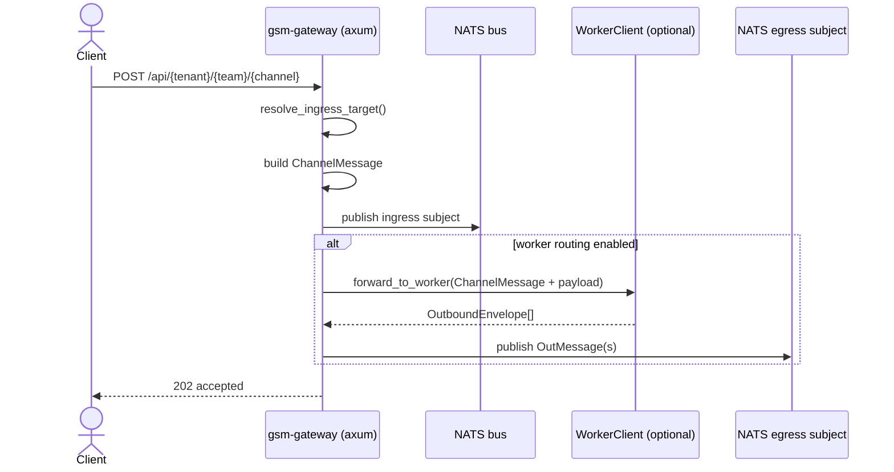
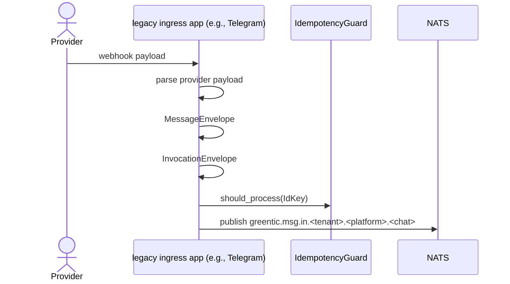
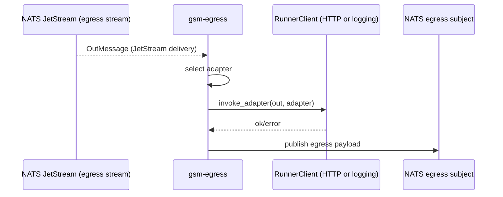

# 02-runtime-flows

This section documents concrete end-to-end flows with call paths, key structs, and background loops.

## Flow 1: Gateway HTTP ingress -> NATS ingress subject (with optional worker)

- Key functions: `build_router_with_bus`, `handle_ingress`, `publish`, `resolve_ingress_target`, `forward_to_worker`. (Evidence: `apps/messaging-gateway/src/http.rs:118-357`; `docs/audit/_evidence/rg/providers.txt`)
- Structs at each stage: `NormalizedRequest` -> `ChannelMessage` -> NATS subject (ingress) -> optional `OutboundEnvelope` -> `OutMessage`. (Evidence: `apps/messaging-gateway/src/http.rs:47-357`; `libs/core/src/types.rs:12-239`; `docs/audit/_evidence/rg/envelopes.txt`)
- Input/outputs: HTTP JSON in, NATS publish to `greentic.messaging.ingress.*` (and optionally `greentic.messaging.egress.*.repo-worker`). (Evidence: `apps/messaging-gateway/src/http.rs:268-330`; `apps/messaging-gateway/src/config.rs:55-64`; `docs/audit/_evidence/rg/envelopes.txt`)
- Error handling: publish errors map to HTTP 503; worker failures logged. (Evidence: `apps/messaging-gateway/src/http.rs:270-337`; `docs/audit/_evidence/rg/overlaps_wip.txt`)

## Flow 2: Legacy webhook ingress -> MessageEnvelope -> InvocationEnvelope -> NATS (greentic.msg.in)

- Example call path (Telegram ingress): `handle_update_scoped` -> `process_update` -> `invocation_from_message` -> `in_subject` publish. (Evidence: `legacy/apps/ingress-telegram/src/main.rs:477-608`; `docs/audit/_evidence/rg/envelopes.txt`)
- Structs: `MessageEnvelope` + `InvocationEnvelope` (payload), `IdemKey` for dedupe. (Evidence: `legacy/apps/ingress-telegram/src/main.rs:447-612`; `libs/core/src/types.rs:94-201`; `docs/audit/_evidence/rg/envelopes.txt`)
- Topics: legacy ingress publishes to `greentic.msg.in.*` subjects (via `in_subject`). (Evidence: `legacy/apps/ingress-telegram/src/main.rs:577-608`; `libs/core/src/subjects.rs:20-47`; `docs/audit/_evidence/rg/envelopes.txt`)
- Error handling: publish failures emit DLQ entries and HTTP error responses. (Evidence: `legacy/apps/ingress-telegram/src/main.rs:586-607`; `docs/audit/_evidence/rg/state_store.txt`)

## Flow 3: Outbound send path (OutMessage -> runner invoke -> egress publish)

- Key functions: `run` (JetStream consumer), `process_message`, `process_message_internal`. (Evidence: `apps/messaging-egress/src/main_logic.rs:21-206`; `docs/audit/_evidence/rg/envelopes.txt`)
- Structs: `OutMessage` -> adapter selection -> publish JSON payload. (Evidence: `apps/messaging-egress/src/main_logic.rs:112-190`; `libs/core/src/types.rs:203-239`; `docs/audit/_evidence/rg/envelopes.txt`)
- Topics: consumer uses `MESSAGING_EGRESS_SUBJECT` filter; output uses `greentic.messaging.egress.out.*` prefix. (Evidence: `apps/messaging-egress/src/config.rs:22-31`; `crates/gsm-bus/src/lib.rs:1-63`; `docs/audit/_evidence/rg/envelopes.txt`)
- Error handling: runner failures logged + metrics, but message is acked after processing attempt. (Evidence: `apps/messaging-egress/src/main_logic.rs:84-105`; `docs/audit/_evidence/rg/overlaps_wip.txt`)

## Background loops and workers

- gsm-runner: two NATS subscriptions (primary + replay), spawns per-message tasks, and writes sessions. (Evidence: `apps/runner/src/main.rs:37-205`; `docs/audit/_evidence/rg/state_store.txt`)
- gsm-egress: JetStream push consumer loop with explicit ack. (Evidence: `apps/messaging-egress/src/main_logic.rs:46-107`; `docs/audit/_evidence/rg/state_store.txt`)
- DLQ: JetStream stream + subjects per tenant/stage; replay subject subscription in runner. (Evidence: `libs/dlq/src/lib.rs:32-141`; `apps/runner/src/main.rs:41-65`; `docs/audit/_evidence/rg/state_store.txt`)

## Known Unknowns

- `InvocationEnvelope` and other greentic-types payload fields are defined in external crates; internal field details beyond usage sites here are not visible. (Evidence: `libs/core/src/types.rs:5-200`; `docs/audit/_evidence/cargo-metadata.json:1`)
